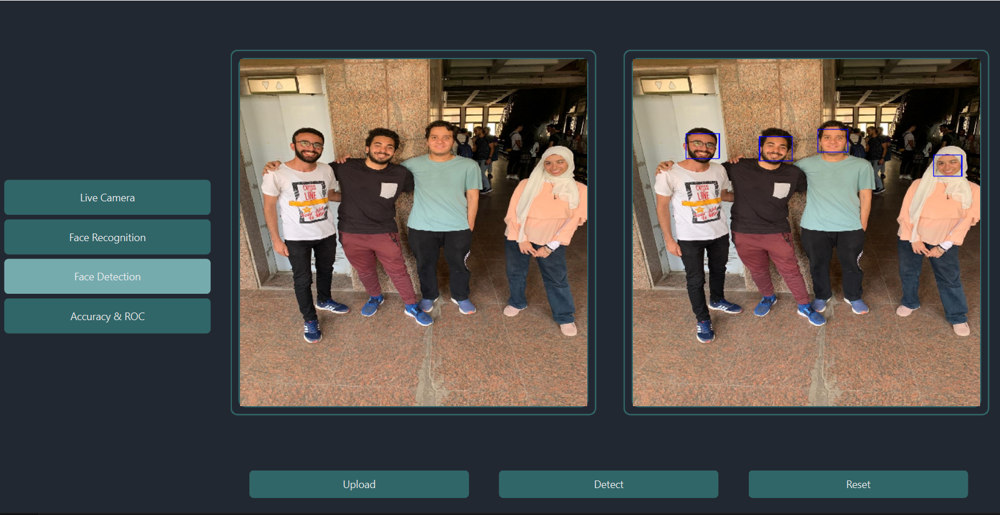
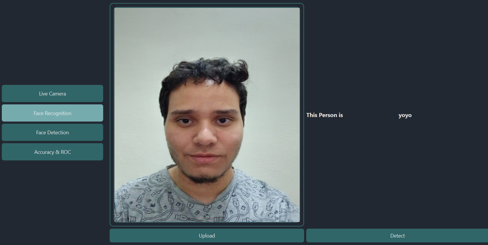
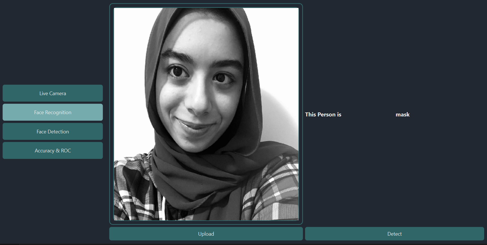
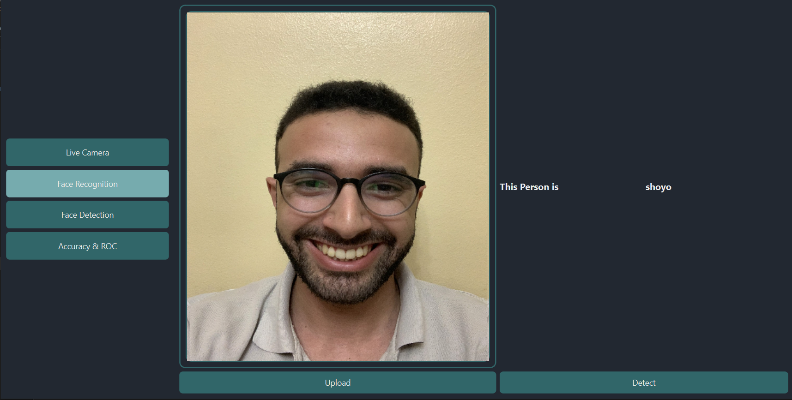
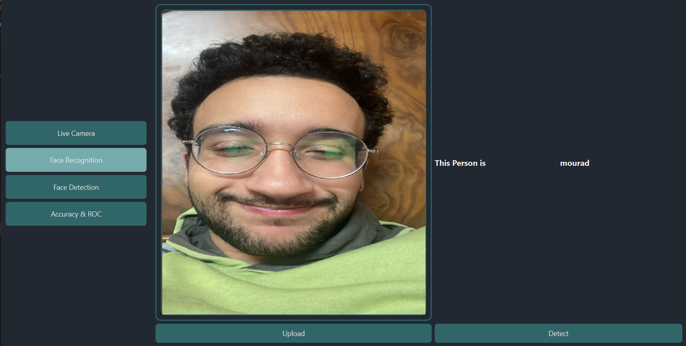
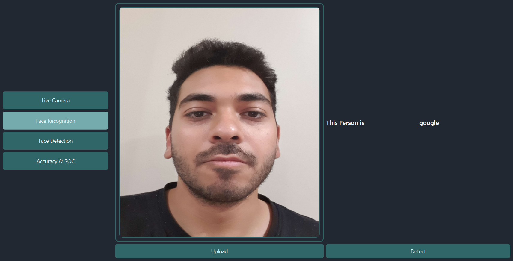
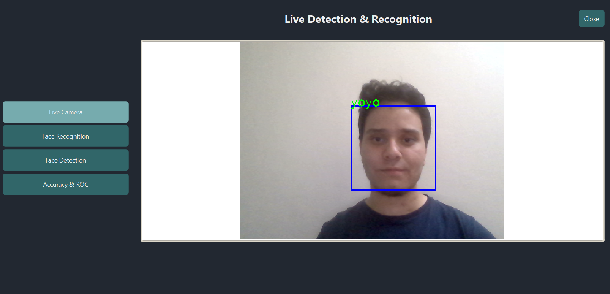

# Recognize faces Application

## Table of contents:

- [Introduction](#introduction)
- [Project Features](#project-features)
- [Project Structure](#project-structure)
- [Quick Preview](#quick-preview)
- [Requirements to run](#Requirements-to-run)
- [Run the project](#Run-the-project)
- [Try a demo](#Try-a-demo)
- [Contributors](#contributors)

---

### Introduction

Our application, built with C++, specializes in face detection and recognition using PCA/Eigen analysis. We aim to provide reliable and efficient methods for detecting and recognizing faces in both color and grayscale images. By utilizing C++, we ensure top-notch performance and accurate results.

---

### Project Features

In this project:

- [x] Live Face Detection:
  - Our application is equipped with real-time face detection functionality. It can instantly detect faces as they appear in camera feeds, providing instantaneous results for dynamic environments.
- [x] Face Detection:
  - Our application employs advanced techniques to detect faces in images. It can analyze both color and grayscale images, making it versatile
    and adaptable to various scenarios. The face detection algorithm efficiently identifies facial features, enabling accurate localization of
    faces within the images.
- [x] Face Recognition with PCA/Eigen Analysis:
  - Once the faces are detected, our application utilizes PCA/Eigen analysis for face recognition. This method extracts the essential facial
    features and represents them in a lower-dimensional space. By comparing these features, the application can recognize and match faces with a
    high degree of accuracy.
- [x] Performance Reporting:
  - Our application provides comprehensive performance reports, allowing users to evaluate the effectiveness of the face detection and
    recognition algorithms. The reports include metrics such as precision, providing insights into the application's performance.
- [x] ROC Curve Plotting:
  - In addition to performance metrics, our application generates Receiver Operating Characteristic (ROC) curves. These curves plot the true
    positive rate against the false positive rate at various thresholds, providing a visual representation of the algorithm's performance. ROC
    curves are widely used in evaluating the effectiveness of face recognition systems.

---

### Project Structure

The Application is built using:

- Qt Version 6.4.2
- OpenCV 4.9.0

```
main
├─ FaceRecognition
│  ├─ FaceRecognition/Models:
│  ├─ FaceRecognition/Views: include ui/header / resource file related to pages design.
│  ├─ FaceRecognition/Controllers: Contains the controllers responsible for handling communication between models and views.
│  ├─ FaceRecognition/Helpers: used for common app logic and different ui functionality.
│  ├─ FaceRecognition/Assets:  Models used in facedetection
│  ├─ FaceRecognition/data: generated .txt files saving the trained PCA
│  ├─ FaceRecognition/dataset: dataset used in training/testing
└─ Gallery/test/unknowns : images used for testing.

```

---

### Quick Preview

#### Face Detection



#### Offline Face Recgonition

| Face Recgonition 1 | Face Recgonition 2 | Face Recgonition 3 |
| :----------------: | :----------------: | :----------------: |
|     |     |     |

| Face Recgonition 4 | Face Recgonition 5 |
| :----------------: | :----------------: |
|     |     |

#### Live Face Detection and Recognition



---

### Requirements to run

[ Qt Setup and openCV ](installCV.md)

1. Ensure Qt is installed on your system.
2. Clone the VisionX repository to your local machine.

---

### Installation

### How to run the project

- Download and Install Qt from the online installer using minGW 64 architecture.

```
www.qt.io
```

- Download and build openCV 4.9.0 from their website

```
www.opencv.org/releases/
```

- if you don't know how to build OpenCV on your PC please refer to the installCV.md

- Go to the Task1.pro file and ensure that openCV libraries are referred to in your pc like that.

Windows

```
INCLUDEPATH += <yourCV build folder path>\install\include

LIBS += -L<yourCV build folder path>\release\lib \
    -lopencv_calib3d490                 \
    -lopencv_core490                    \
    -lopencv_features2d490              \
    -lopencv_flann490                   \
    -lopencv_highgui490                 \
    -lopencv_imgproc490                 \
    -lopencv_imgcodecs490               \
    -lopencv_photo490                   \
    -lopencv_stitching490               \
    -lopencv_ts490                      \
    -lopencv_video490                   \
    -lopencv_videoio490                 \
    -lopencv_objdetect490               \
```

Linux

```pretrained
CONFIG += link_pkgconfig
PKGCONFIG += opencv4
```

### Building

1. Open the project in Qt Creator.
2. Make sure your .pro file matches commonpro.txt file
3. Add folders "dataset4" with the training dataset, "dataset4files" empty , "test" with your testing data, "dataset4live" with training live data to your build directory
4. Build the project to generate the executable.

### Try a demo

[ Download Here !]

---

### Contributors

<table>
  <tr>
      <td align="center">
    <a href="https://github.com/abduelrahmanemad" target="_black">
    
    <br />
    <sub><b>Abdulrahman Emad</b></sub></a>
    </td>
    <td align="center">
    <a href="https://github.com/mouradmagdy" target="_black">
    
    <br />
    <sub><b>Mourad Magdy</b></sub></a>
    <td align="center">
    <a href="https://github.com/ZiadMeligy" target="_black">
    
    <br />
    <sub><b>Ziad Meligy</b></sub></a>
    </td>
    </td>
    <td align="center">
    <a href="https://github.com/Maskuerade" target="_black">
    
    <br />
    <sub><b>Mariam Ahmed</b></sub></a>
    </td>
     <td align="center">
    <a href="https://github.com/Youssef-Ashraf71" target="_black">
    
    <br />
    <sub><b>Youssef Ashraf</b></sub></a>
    </td>
      </tr>
 </table>
